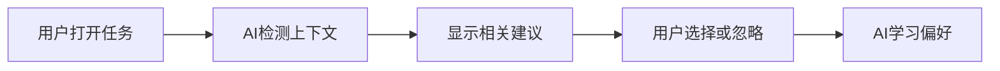
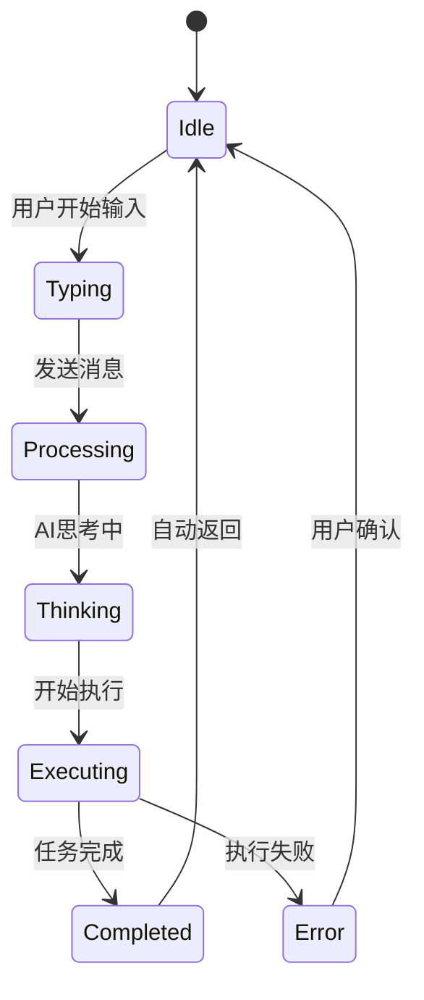
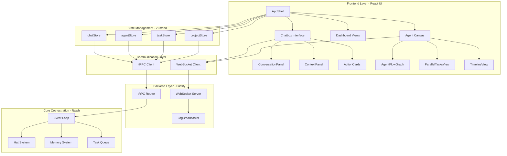
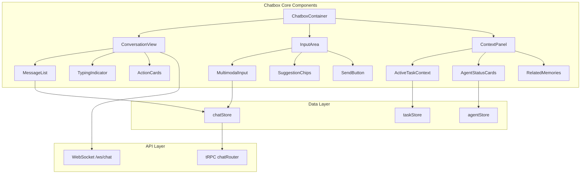
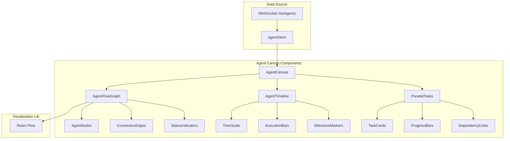
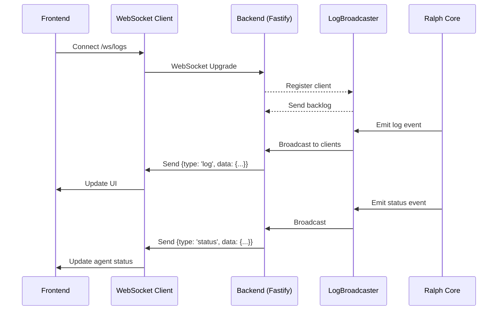
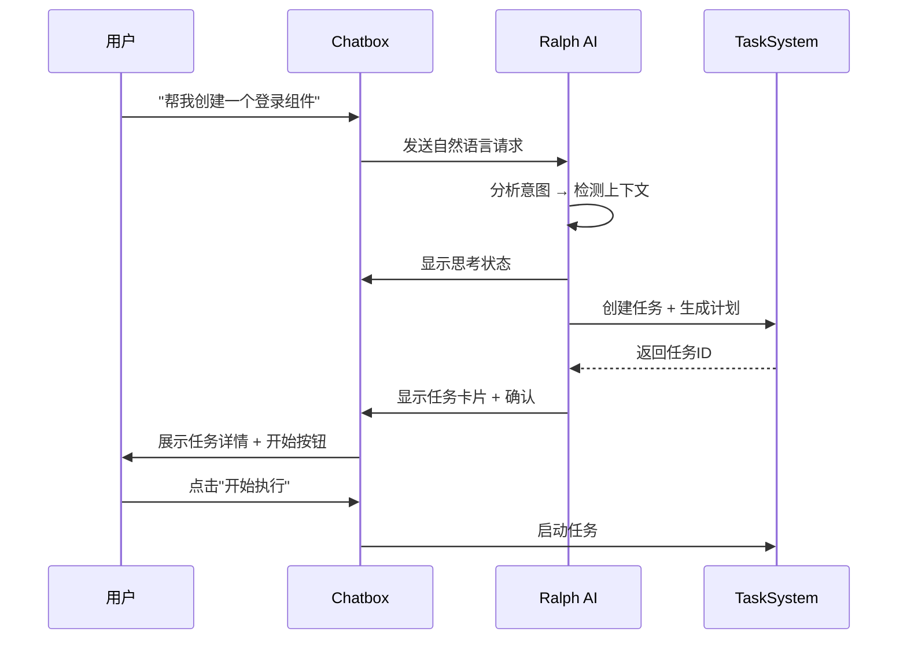

# Ralph Web Dashboard UI改造计划

> **创建时间**: 2026-02-26
> **分析目标**: 对比主流AI平台UI设计，制定Ralph Dashboard改造计划，构建类似Codex/Claude Cowork的AI Chatbox体验
> **版本**: v2.0

---

## 目录

- [一、竞品分析](#一竞品分析)
- [二、AI Chatbox UI设计模式](#二ai-chatbox-ui设计模式)
- [三、Ralph Dashboard现状分析](#三ralph-dashboard现状分析)
- [四、架构设计](#四架构设计)
- [五、交互式AI功能设计](#五交互式ai功能设计)
- [六、差距分析](#六差距分析)
- [七、改造方案](#七改造方案)
- [八、实施路线图](#八实施路线图)

---

## 一、竞品分析

### 1.1 Codex App (OpenAI, 2026-02-03发布)

**产品定位**: macOS原生Agent编排应用

**UI设计亮点**:
- **Agent管理中心**: 专门设计用于管理多个AI代理的界面，支持平滑任务切换
- **多线程并行界面**: 不同任务的并行代理线程(重构、测试、前端更新)
- **Git Worktrees集成**: 隐式后端支持，允许代理在隔离沙箱中工作
- **视觉设计**: 用户反馈UI美学"比Cursor高几个等级"
- **中文本地化**: 支持个性化设置中文输出
- **Skills库UI**: 内置技能库界面，包括Figma-to-Code实现、图片生成、云部署等

**设计隐喻**: "指挥中心"模式 - 高度视觉化、专业感强

---

### 1.2 Claude Cowork (Anthropic, 2026-01-12发布)

**产品定位**: "Claude Code for the rest of your work" - 面向普通知识工作者的AI代理

**UI设计亮点**:
- **桌面GUI替代命令行**: 移除终端障碍，友好的桌面界面
- **任务可视化**: 视觉化显示任务执行进度
- **上下文支持**: 用户可附加文件夹作为工作上下文
- **提示词驱动**: 简洁的任务启动方式
- **任务与聊天分离**: 明确区分任务执行和对话交互

**设计理念**:
1. 去除任务特定输入框和脚手架
2. 系统更好地理解用户意图
3. 根据上下文动态分支界面(如检测使用应用X时弹出相关UI)

---

### 1.3 OpenCode (开源替代品)

**产品定位**: 免费开源的AI编码替代方案

**UI设计亮点**:
- **跨平台支持**: Mac、Windows、Linux
- **多提供商UI**: 统一界面支持GLM-4.7等多个提供商
- **免费开源**: 社区驱动

---

## 二、AI Chatbox UI设计模式

### 2.1 核心交互模式 (2026最佳实践)

基于最新AI UX研究([来源](https://juejin.cn/post/7556142470908919848), [来源](https://juejin.cn/post/7583971282892455988))：

#### 2.1.1 多模态交互支持

| 模态 | 最佳使用场景 | 实现优先级 |
|------|-------------|-----------|
| **文本** | 快速查询、详细指令 | P0 - 已实现 |
| **语音** | 免提场景、无障碍访问 | P1 |
| **图片** | 视觉分析、创意任务 | P2 |
| **文件拖拽** | 上下文附件 | P1 |

**实现建议**:
```typescript
// 统一输入组件支持多种模态
interface MultimodalInput {
  text: string;
  voice?: Blob;           // 语音转文字
  images?: File[];        // 图片OCR/分析
  files?: File[];         // 文件上下文
}
```

---

#### 2.1.2 主动式UX设计

**核心理念**: AI系统应该预测用户需求，而非等待命令

**实现模式**:
1. **预测性建议** - 根据当前上下文提供下一步操作建议
2. **自适应界面** - 根据用户行为动态调整布局
3. **智能提示** - 在用户卡住时主动提供帮助
4. **上下文连续性** - 跨会话记住历史和偏好

**示例UX**:


---

#### 2.1.3 渐进式披露

**原则**: 避免信息过载，按需展示高级功能

| 层级 | 内容 | 触发条件 |
|------|------|----------|
| **基础** | 简单任务输入框 | 首次使用 |
| **进阶** | 技能选择、参数配置 | 3次使用后 |
| **专家** | 完整Hat配置、事件流 | 用户主动开启 |

---

#### 2.1.4 AI透明度设计

**信任构建关键要素**:
1. **置信度显示** - AI对建议的确定程度(高/中/低)
2. **决策解释** - AI为什么采取某个行动
3. **能力边界** - 明确说明AI能做什么/不能做什么
4. **错误恢复** - AI失败时的优雅降级

**UI模式**:
```typescript
// AI置信度指示器
interface AIConfidence {
  level: 'high' | 'medium' | 'low';
  explanation?: string;  // "基于3个相似任务..."
  alternatives?: string[];  // 低置信度时提供备选
}
```

---

### 2.2 对话式界面模式

#### 2.2.1 消息类型设计

| 消息类型 | UI表现 | 用途 |
|---------|--------|------|
| **用户消息** | 右对齐气泡 | 用户输入 |
| **AI响应** | 左对齐卡片 | AI回复 |
| **系统通知** | 顶部Toast | 非阻塞提示 |
| **进度更新** | 行内进度条 | 长时间任务 |
| **错误消息** | 红色警告框 | 失败处理 |
| **行动卡片** | 可交互按钮 | AI建议操作 |

---

#### 2.2.2 输入状态模式



**UI表现**:
- **Thinking**: 脉动动画 + "正在分析..."
- **Executing**: 进度条 + "正在执行步骤 3/5"
- **Error**: 红色高亮 + 重试/修改选项

---

### 2.3 视觉设计趋势 (2026)

#### 2.3.1 流行UI风格

| 风格 | 特点 | 适用场景 |
|------|------|----------|
| **Glassmorphism** | 毛玻璃效果、半透明 | 悬停面板、卡片 |
| **Claymorphism** | 3D粘土质感、软阴影 | 按钮、图标 |
| **Neumorphism** | 凹凸浮雕、低对比 | 开关、滑块 |
| **Bento Grid** | 网格模块化布局 | 仪表盘、功能区 |

**推荐组合**:
- 主布局: Bento Grid (模块化仪表盘)
- 悬浮元素: Glassmorphism (现代感)
- 交互控件: Claymorphism (触感反馈)

---

#### 2.3.2 色彩系统

**2026流行配色** ([来源](https://m.blog.csdn.net/gitblog_00568/article/details/151938575)):

```css
/* 暗色主题优化 */
--bg-primary: #09090b;      /* 深黑背景 */
--bg-secondary: #18181b;    /* 卡片背景 */
--accent-primary: #8b5cf6;  /* 紫色主色 - AI感 */
--accent-secondary: #06b6d4;/* 青色辅色 - 科技感 */
--text-primary: #fafafa;    /* 主文本 */
--text-muted: #a1a1aa;      /* 次要文本 */
--success: #10b981;         /* 成功绿 */
--warning: #f59e0b;         /* 警告黄 */
--error: #ef4444;           /* 错误红 */
```

---

### 2.4 动画与微交互

#### 2.4.1 必需动画清单

| 动画类型 | 时长 | 缓动函数 | 用途 |
|---------|------|---------|------|
| **页面过渡** | 300ms | ease-in-out | 路由切换 |
| **卡片悬停** | 200ms | ease-out | 鼠标悬停 |
| **状态变化** | 150ms | ease | 进度更新 |
| **消息弹出** | 250ms | spring | 新消息 |
| **加载骨架** | 循环 | linear | 数据加载 |

**实现建议**:
```typescript
// 使用Framer Motion统一动画管理
import { motion } from 'framer-motion';

const variants = {
  pageTransition: {
    initial: { opacity: 0, y: 20 },
    animate: { opacity: 1, y: 0 },
    exit: { opacity: 0, y: -20 },
    transition: { duration: 0.3 }
  }
};
```

---

## 三、Ralph Dashboard现状分析

### 3.1 技术架构

| 组件 | 技术 | 状态 |
|------|------|------|
| 前端框架 | React + Vite | ✅ |
| UI库 | TailwindCSS + shadcn/ui | ✅ |
| 状态管理 | Zustand | ✅ |
| 图标库 | lucide-react | ✅ |
| 数据获取 | tRPC | ✅ |
| 国际化 | i18n | ✅ |
| 主题系统 | 明/暗/系统切换 | ✅ |
| WebSocket | 实时日志流 | ✅ |

---

### 3.2 当前UI结构

**布局**: 左侧可折叠导航栏 + 主内容区域

**导航分组** (13个页面，4个分组):
1. **Orchestration** - Dashboard, Tasks, Kanban, Planning
2. **Team** - Teams, Skills
3. **Operations** - Monitoring, Checkpoints, Healing
4. **Configuration** - Projects, Builder, Settings

---

### 3.3 设计风格特点

- ✅ 暗色主题为主(hacker美学)
- ✅ 卡片式布局
- ✅ Lucide图标
- ✅ 响应式设计
- ✅ 移动端适配
- ✅ 无障碍支持
- ✅ 国际化支持

**缺失**:
- ❌ AI Chatbox界面
- ❌ Agent协作可视化
- ❌ 流畅过渡动画
- ❌ 主动式UX

---

## 四、架构设计

### 4.1 整体系统架构



---

### 4.2 AI Chatbox组件架构



**组件职责**:

| 组件 | 职责 | Props |
|------|------|-------|
| `ChatboxContainer` | 容器，管理状态 | `activeProjectId` |
| `ConversationView` | 消息列表展示 | `messages`, `onAction` |
| `InputArea` | 多模态输入 | `onSend`, `suggestions` |
| `ContextPanel` | 上下文信息面板 | `task`, `agents`, `memories` |
| `MessageList` | 虚拟滚动消息 | `messages[]` |
| `ActionCards` | AI建议操作 | `actions[]` |
| `MultimodalInput` | 文本/语音/文件输入 | `onSubmit` |

---

### 4.3 Agent可视化架构



---

### 4.4 状态管理架构

```mermaid
graph TB
    subgraph "Zustand Stores"
        A[chatStore]
        B[agentStore]
        C[taskStore]
        D[projectStore]
        E[uiStore]
    end

    subgraph "chatStore State"
        A1[messages: Message[]]
        A2[isThinking: boolean]
        A3[currentTask: Task]
        A4[suggestions: Suggestion[]]
    end

    subgraph "agentStore State"
        B1[agents: Agent[]]
        B2[activeHats: Hat[]]
        B3[relationships: Connection[]]
    end

    subgraph "taskStore State"
        C1[tasks: Task[]]
        C2[queue: QueuedTask[]]
        C3[activeTask: Task]
    end

    A --> A1
    A --> A2
    A --> A3
    A --> A4

    B --> B1
    B --> B2
    B --> B3

    C --> C1
    C --> C2
    C --> C3
```

**Store接口定义**:

```typescript
// stores/chatStore.ts
interface ChatStore {
  // State
  messages: Message[];
  isThinking: boolean;
  currentTask: Task | null;
  suggestions: Suggestion[];

  // Actions
  sendMessage: (content: string, context?: Context) => Promise<void>;
  executeAction: (action: Action) => Promise<void>;
  clearHistory: () => void;
}

// stores/agentStore.ts
interface AgentStore {
  // State
  agents: Agent[];
  activeHats: Hat[];
  relationships: Connection[];

  // Actions
  subscribeToAgents: (loopId: string) => void;
  updateAgentStatus: (agentId: string, status: AgentStatus) => void;
}
```

---

### 4.5 WebSocket实时通信架构



**消息协议**:

```typescript
// WebSocket Message Types
type WSMessage =
  | { type: 'log'; taskId: string; data: LogEntry }
  | { type: 'status'; loopId: string; data: LoopStatus }
  | { type: 'event'; eventType: string; data: unknown }
  | { type: 'agent'; agentId: string; data: AgentState }
  | { type: 'progress'; taskId: string; data: ProgressUpdate };

// Frontend Hook
function useTaskWebSocket(taskId: string) {
  const [messages, setMessages] = useState<LogEntry[]>([]);

  useEffect(() => {
    const ws = new WebSocket(`ws://localhost:3000/ws/logs?taskId=${taskId}`);

    ws.onmessage = (event) => {
      const message: WSMessage = JSON.parse(event.data);
      if (message.type === 'log') {
        setMessages(prev => [...prev, message.data]);
      }
    };

    return () => ws.close();
  }, [taskId]);

  return messages;
}
```

---

### 4.6 前端路由架构

```mermaid
graph TB
    subgraph "Routes"
        A[/ - Home]
        B[/tasks - Tasks]
        C[/agents - Agents]
        D[/runtime - Runtime]
        E[/settings - Settings]
    end

    subgraph "Home View"
        A1[UnifiedDashboard]
        A2[QuickActions]
        A3[RecentTasks]
        A4[SystemStatus]
    end

    subgraph "Tasks View"
        B1[TaskKanban]
        B2[TaskList]
        B3[TaskDetail]
        B4[ChatboxOverlay]
    end

    subgraph "Agents View"
        C1[AgentCanvas]
        C2[TeamsList]
        C3[SkillsLibrary]
    end

    subgraph "Runtime View"
        D1[LiveMonitoring]
        D2[CheckpointTimeline]
        D3[HealingHistory]
    end

    subgraph "Settings View"
        E1[Preferences]
        E2[ProjectManager]
        E3[Builder]
    end

    A --> A1
    A --> A2
    A --> A3
    A --> A4

    B --> B1
    B --> B2
    B --> B3
    B --> B4

    C --> C1
    C --> C2
    C --> C3

    D --> D1
    D --> D2
    D --> D3

    E --> E1
    E --> E2
    E --> E3
```

**路由配置**:

```typescript
// App.tsx
const routes = [
  {
    path: '/',
    element: <HomeView />,
    children: [
      { index: true, element: <UnifiedDashboard /> }
    ]
  },
  {
    path: '/tasks',
    element: <TasksView />,
    children: [
      { index: true, element: <TaskKanban /> },
      { path: ':taskId', element: <TaskDetail /> }
    ]
  },
  {
    path: '/agents',
    element: <AgentsView />,
    children: [
      { index: true, element: <AgentCanvas /> },
      { path: 'teams', element: <TeamsList /> },
      { path: 'skills', element: <SkillsLibrary /> }
    ]
  },
  {
    path: '/runtime',
    element: <RuntimeView />,
    children: [
      { index: true, element: <LiveMonitoring /> },
      { path: 'checkpoints', element: <CheckpointTimeline /> },
      { path: 'healing', element: <HealingHistory /> }
    ]
  },
  {
    path: '/settings',
    element: <SettingsView />,
    children: [
      { index: true, element: <Preferences /> },
      { path: 'projects', element: <ProjectManager /> },
      { path: 'builder', element: <Builder /> }
    ]
  }
];
```

---

## 五、交互式AI功能设计

### 5.1 AI Chatbox核心功能

#### 5.1.1 对话式任务创建

**用户流程**:


**UI实现**:

```typescript
// components/chatbox/ConversationView.tsx
export function ConversationView() {
  const { messages, isThinking } = useChatStore();
  const { scrollToBottom } = useChatScroll();

  return (
    <div className="flex flex-col h-full">
      {/* Message List */}
      <div className="flex-1 overflow-y-auto p-4">
        {messages.map((msg) => (
          <MessageBubble key={msg.id} message={msg} />
        ))}

        {/* Thinking Indicator */}
        {isThinking && (
          <motion.div
            initial={{ opacity: 0, y: 10 }}
            animate={{ opacity: 1, y: 0 }}
            className="flex items-center gap-2 text-muted-foreground"
          >
            <Loader2 className="animate-spin" />
            <span>正在分析...</span>
          </motion.div>
        )}
      </div>

      {/* Action Cards */}
      <ActionCardsContainer />

      {/* Input Area */}
      <InputArea />
    </div>
  );
}
```

---

#### 5.1.2 上下文感知建议

**智能提示模式**:

| 触发场景 | AI建议类型 | UI表现 |
|---------|-----------|--------|
| **首次使用** | 功能引导 | 高亮新手教程 |
| **重复任务** | 快捷模板 | "再次创建类似任务?" |
| **错误发生** | 修复建议 | "应用已知修复?" |
| **任务完成** | 下一步 | "现在可以测试/部署" |
| **空闲状态** | 探索建议 | "查看团队配置" |

**实现**:

```typescript
// components/chatbox/SuggestionChips.tsx
export function SuggestionChips() {
  const { suggestions } = useChatStore();
  const { executeSuggestion } = useChatActions();

  if (suggestions.length === 0) return null;

  return (
    <div className="flex flex-wrap gap-2 p-2">
      {suggestions.map((suggestion) => (
        <Button
          key={suggestion.id}
          variant="outline"
          size="sm"
          onClick={() => executeSuggestion(suggestion)}
          className="gap-2"
        >
          <Sparkles className="w-4 h-4" />
          {suggestion.label}
          <Badge variant="secondary">
            {suggestion.confidence}%
          </Badge>
        </Button>
      ))}
    </div>
  );
}
```

---

#### 5.1.3 多模态输入支持

**统一输入界面**:

```typescript
// components/chatbox/MultimodalInput.tsx
export function MultimodalInput() {
  const [input, setInput] = useState('');
  const [files, setFiles] = useState<File[]>([]);
  const [isRecording, setIsRecording] = useState(false);

  const handleSend = async () => {
    const message: MultimodalInput = {
      text: input,
      files: files.length > 0 ? files : undefined,
      voice: isRecording ? await captureVoice() : undefined
    };

    await sendMessage(message);
    setInput('');
    setFiles([]);
  };

  return (
    <div className="border-t p-4">
      {/* Context Files */}
      {files.length > 0 && (
        <div className="flex gap-2 mb-2">
          {files.map((file) => (
            <FileChip key={file.name} file={file} onRemove={() => removeFile(file)} />
          ))}
        </div>
      )}

      {/* Input Area */}
      <div className="flex gap-2">
        <AttachmentButton onFilesSelected={setFiles} />
        <Textarea
          value={input}
          onChange={(e) => setInput(e.target.value)}
          placeholder="输入任务描述，或拖拽文件..."
          onKeyDown={(e) => e.key === 'Enter' && !e.shiftKey && handleSend()}
        />
        <VoiceButton
          isRecording={isRecording}
          onToggle={setIsRecording}
        />
        <SendButton onClick={handleSend} disabled={!input.trim()} />
      </div>
    </div>
  );
}
```

---

### 5.2 Agent协作可视化

#### 5.2.1 Agent关系图

**基于React Flow的节点图**:

```typescript
// components/agents/AgentFlowGraph.tsx
import { Flow, Node, Edge } from 'reactflow';

export function AgentFlowGraph() {
  const { agents, relationships } = useAgentStore();

  // Convert agents to nodes
  const nodes: Node[] = agents.map((agent) => ({
    id: agent.id,
    type: 'agentNode',
    position: agent.position,
    data: {
      label: agent.name,
      hat: agent.hat,
      status: agent.status,
      task: agent.currentTask
    }
  }));

  // Convert relationships to edges
  const edges: Edge[] = relationships.map((rel) => ({
    id: rel.id,
    source: rel.from,
    target: rel.to,
    type: 'smoothstep',
    animated: rel.active,
    label: rel.type
  }));

  return (
    <div className="h-full w-full">
      <Flow
        nodes={nodes}
        edges={edges}
        nodeTypes={{ agentNode: AgentNodeComponent }}
        fitView
      >
        <Background />
        <Controls />
      </Flow>
    </div>
  );
}
```

**Agent节点组件**:

```typescript
// components/agents/AgentNode.tsx
export function AgentNode({ data }: NodeProps) {
  return (
    <div className="px-4 py-2 shadow-md rounded-md bg-white dark:bg-gray-800 border-2">
      {/* Status Indicator */}
      <div className={`w-3 h-3 rounded-full ${getStatusColor(data.status)}`} />

      {/* Agent Info */}
      <div className="font-bold">{data.label}</div>
      <div className="text-xs text-gray-500">{data.hat}</div>

      {/* Current Task */}
      {data.task && (
        <Badge variant="outline" className="mt-1">
          {data.task}
        </Badge>
      )}
    </div>
  );
}
```

---

#### 5.2.2 并行任务时间线

```typescript
// components/agents/AgentTimeline.tsx
export function AgentTimeline() {
  const { tasks } = useTaskStore();

  return (
    <div className="relative">
      {/* Time Scale */}
      <div className="flex justify-between text-xs text-muted-foreground mb-2">
        <span>00:00</span>
        <span>00:30</span>
        <span>01:00</span>
      </div>

      {/* Task Bars */}
      {tasks.map((task) => (
        <div key={task.id} className="mb-2">
          <div className="text-sm font-medium">{task.title}</div>
          <div className="relative h-8 bg-secondary rounded">
            <div
              className="absolute h-full bg-primary rounded"
              style={{
                left: `${task.startTime}%`,
                width: `${task.duration}%`
              }}
            >
              <div className="px-2 text-xs text-white">{task.status}</div>
            </div>
          </div>
        </div>
      ))}

      {/* Current Time Indicator */}
      <div
        className="absolute top-0 bottom-0 w-0.5 bg-red-500"
        style={{ left: `${currentTimePercent}%` }}
      />
    </div>
  );
}
```

---

### 5.3 任务执行可视化

#### 5.3.1 细粒度进度条

```typescript
// components/tasks/TaskProgress.tsx
export function TaskProgress({ task }: { task: Task }) {
  const progress = useTaskProgress(task.id);

  return (
    <div className="space-y-2">
      {/* Overall Progress */}
      <div>
        <div className="flex justify-between text-sm mb-1">
          <span>{task.status}</span>
          <span>{progress.percentage}%</span>
        </div>
        <Progress value={progress.percentage} />
      </div>

      {/* Current Step */}
      {progress.currentStep && (
        <div className="flex items-center gap-2 text-sm">
          <Loader2 className="animate-spin w-4 h-4" />
          <span>{progress.currentStep}</span>
        </div>
      )}

      {/* Step List */}
      <div className="space-y-1">
        {progress.steps.map((step, index) => (
          <div
            key={index}
            className={cn(
              "flex items-center gap-2 text-sm",
              step.completed && "text-muted-foreground line-through"
            )}
          >
            <CheckCircle className={cn(step.completed ? "text-green-500" : "text-gray-300")} />
            <span>{step.label}</span>
          </div>
        ))}
      </div>
    </div>
  );
}
```

---

#### 5.3.2 实时日志流

```typescript
// components/tasks/LiveLogs.tsx
export function LiveLogs({ taskId }: { taskId: string }) {
  const logs = useTaskLogs(taskId);
  const containerRef = useRef<HTMLDivElement>(null);

  // Auto-scroll to bottom
  useEffect(() => {
    if (containerRef.current) {
      containerRef.current.scrollTop = containerRef.current.scrollHeight;
    }
  }, [logs]);

  return (
    <div ref={containerRef} className="h-64 overflow-y-auto font-mono text-sm bg-black text-green-400 p-2">
      {logs.map((log, index) => (
        <div key={index} className={cn(
          "whitespace-pre-wrap",
          log.level === 'error' && "text-red-400",
          log.level === 'warning' && "text-yellow-400"
        )}>
          <span className="text-gray-500">[{log.timestamp}]</span>
          <span>{log.message}</span>
        </div>
      ))}
    </div>
  );
}
```

---

## 六、差距分析

### 6.1 导航复杂度问题

| 问题 | 描述 | 影响 |
|------|------|------|
| **页面过多** | 13个页面分散在4个分组 | 用户迷失、学习成本高 |
| **分组抽象** | "Orchestration/Team/Operations/Configuration"不够直观 | 非技术用户理解困难 |
| **层级过深** | 折叠导航需要多次点击 | 效率降低 |

---

### 6.2 AI Chatbox缺失

| 问题 | 描述 | 影响 |
|------|------|------|
| **无对话式界面** | 当前只有表单式任务创建 | 非技术用户门槛高 |
| **缺少上下文感知** | 无智能建议系统 | 用户需要手动配置 |
| **无多模态输入** | 仅支持文本输入 | 交互方式单一 |
| **AI透明度不足** | AI决策过程不透明 | 信任度低 |

---

### 6.3 Agent协作可视化缺失

| 问题 | 描述 | 影响 |
|------|------|------|
| **多Agent视图缺失** | 当前主要是单任务/单Loop视图 | 无法直观看到Agent协作 |
| **并行执行不可见** | 后台loop运行状态分散 | 难以把握整体进度 |
| **Agent关系不清晰** | Hat系统、Loop之间的协作关系不明确 | 调试困难 |

---

### 6.4 任务执行可视化不足

| 问题 | 描述 | 影响 |
|------|------|------|
| **执行进度抽象** | 状态显示(open/in_progress/closed) | 无法感知具体进度 |
| **实时反馈弱** | WebSocket日志流但缺乏可视化进度条 | 焦虑感强 |
| **上下文切换难** | 多任务时需要在不同页面切换 | 工作流中断 |

---

## 七、改造方案

### 7.1 阶段一: AI Chatbox实现 (优先级 P0)

**目标**: 构建类似Claude Cowork的对话式任务界面

**新增组件**:
1. `ChatboxContainer` - 主容器
2. `ConversationView` - 对话视图
3. `MultimodalInput` - 多模态输入
4. `SuggestionChips` - 智能建议
5. `ActionCards` - AI建议操作

**实施**:
- 创建 `/chatbox` 路由
- 实现 `chatStore` (Zustand)
- 集成 tRPC `chatRouter`
- WebSocket实时流

---

### 7.2 阶段二: 导航简化 (优先级 P1)

**目标**: 从13页面简化到5个核心视图

**新导航结构**:

| 视图 | 描述 | 合并的原页面 |
|------|------|--------------|
| **Home** | 统一仪表盘 + Chatbox | Dashboard + Chatbox |
| **Tasks** | 任务看板 + 执行视图 | Tasks + Kanban + Plan |
| **Agents** | Agent团队 + Skills | Teams + Skills + Canvas |
| **Runtime** | 实时执行 + 监控 | Monitoring + Checkpoints + Healing |
| **Settings** | 配置 + 项目 | Settings + Projects + Builder |

---

### 7.3 阶段三: Agent协作可视化 (优先级 P1)

**目标**: 创建实时Agent协作视图

**新增组件**:
1. `AgentFlowGraph` - Agent关系图 (React Flow)
2. `AgentTimeline` - 执行时间线
3. `ParallelTasks` - 并行任务视图

---

### 7.4 阶段四: 视觉升级 (优先级 P2)

**目标**: 打造"Vibe"感

**改进项**:
1. Glassmorphism/Claymorphism效果
2. 流畅页面过渡动画
3. 增加留白，降低信息密度
4. 统一阴影和圆角

---

## 八、实施路线图

### 8.1 Sprint 1 (2周): AI Chatbox核心

- [ ] ChatboxContainer + ConversationView
- [ ] MultimodalInput组件
- [ ] chatStore实现
- [ ] tRPC chatRouter
- [ ] 基础WebSocket集成

---

### 8.2 Sprint 2 (2周): 智能建议系统

- [ ] SuggestionChips组件
- [ ] ActionCards系统
- [ ] 上下文感知逻辑
- [ ] AI置信度显示

---

### 8.3 Sprint 3 (2周): 导航简化

- [ ] 修改Sidebar导航
- [ ] 合并页面组件
- [ ] 调整路由
- [ ] 更新i18n

---

### 8.4 Sprint 4 (3周): Agent可视化

- [ ] AgentFlowGraph实现
- [ ] AgentTimeline实现
- [ ] WebSocket agent事件流
- [ ] 实时状态更新

---

### 8.5 Sprint 5 (2周): 视觉升级

- [ ] Glassmorphism效果
- [ ] 页面过渡动画
- [ ] 微交互优化
- [ ] 色彩系统调整

---

## 九、参考资源

### 竞品研究
- [Codex App](https://openai.com/codex) - OpenAI Agent编排应用
- [Claude Cowork](https://anthropic.com) - Anthropic桌面AI代理

### AI/UX设计资源
- [2026 UX/UI设计趋势](https://www.163.com/dy/article/KMF6RRBS0556BKC3.html) - 网易分析
- [AI UX设计终极指南](https://m.blog.csdn.net/gitblog_00568/article/details/151938575) - CSDN
- [建构AI Agent应用UX](https://juejin.cn/post/7556142470908919848) - 掘金
- [2025 AI产品设计原则](https://juejin.cn/post/7583971282892455988) - 掘金

### 技术框架
- [shadcn/ui](https://ui.shadcn.com) - React组件库
- [React Flow](https://reactflow.dev) - 流程图可视化
- [Framer Motion](https://www.framer.com/motion) - 动画库
- [Zustand](https://zustand-demo.pmnd.rs) - 状态管理

---

**文档版本**: v2.0
**最后更新**: 2026-02-26
**作者**: Ralph AI Orchestrator
