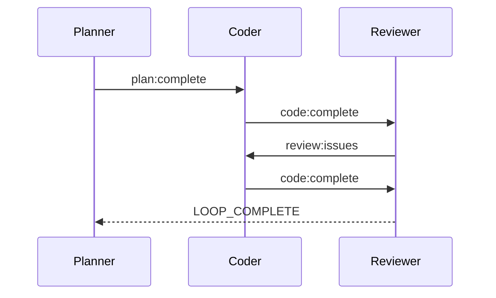

# Multi-Hat Workflow Example

!!! note "Documentation In Progress"
    This page is under development. Check back soon for a complete multi-hat workflow example.

## Overview

This example demonstrates advanced orchestration using multiple hats that switch based on events and context.

## Configuration

```yaml
preset: code-review
hats:
  planner:
    triggers: ["start", "requirements:change"]
  coder:
    triggers: ["plan:complete"]
  reviewer:
    triggers: ["code:complete"]
  fixer:
    triggers: ["review:issues"]
```

## Event Flow



## See Also

- [Hats & Events](../concepts/hats-and-events.md) - Core concepts
- [Creating Custom Hats](../advanced/custom-hats.md) - Custom hat development
- [Presets](../guide/presets.md) - Built-in hat collections
